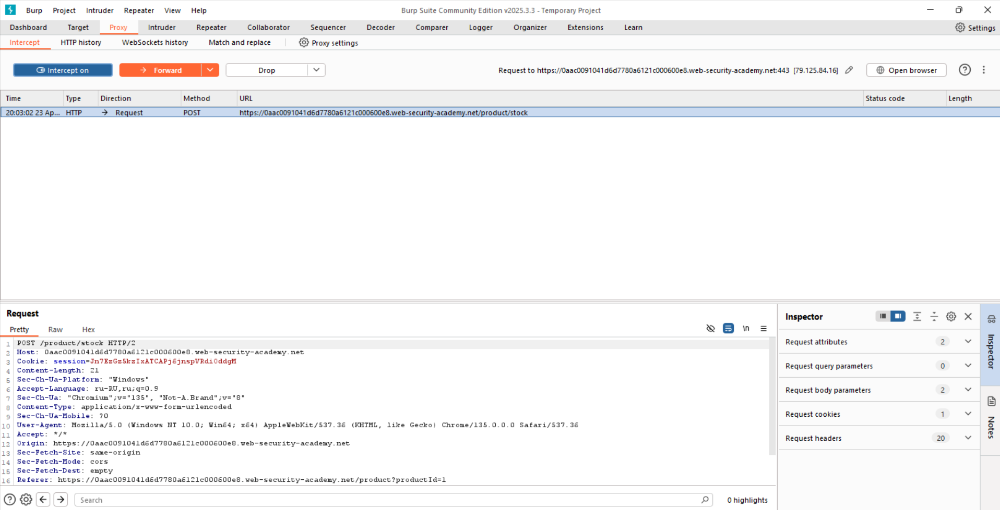
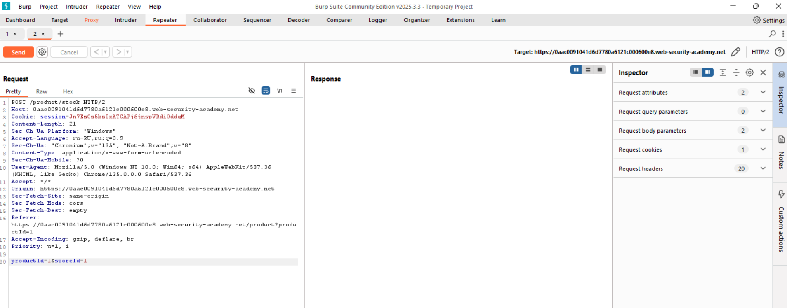
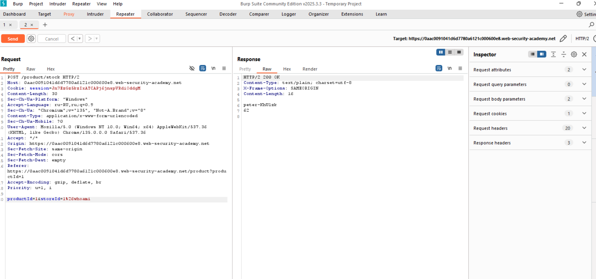
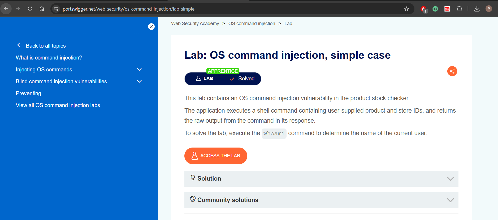

# План решения

1. Зашел на сайт с товаром
2. Включил прокси
3. Выполнил запрос на получение `stock`
4. Скопировал запрос в burp proxy в repeater
5. Добавил в конце `&whoami`, чтобы браузер не воспринял это как GET параметр, нажимаем `Ctrl + U` и переводим амперсанд в `%26`
6. Команда выполнилась и вывела имя пользователя

# Скрины

