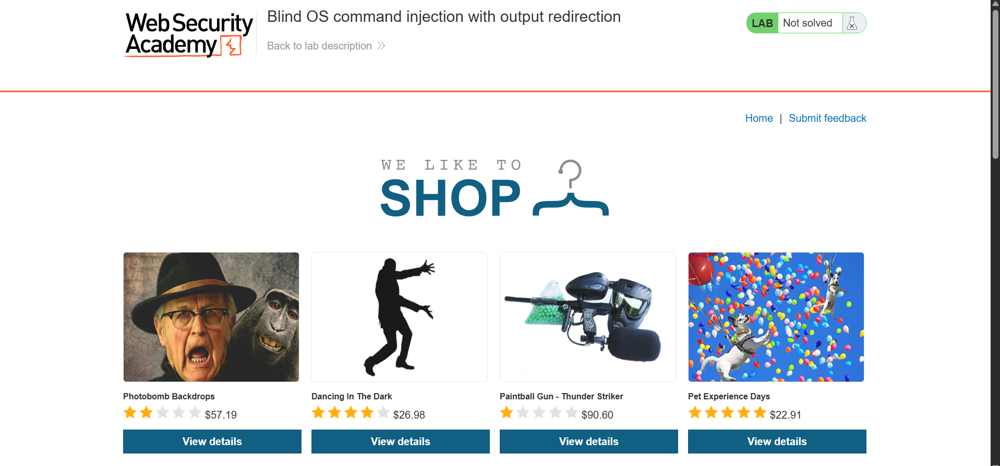
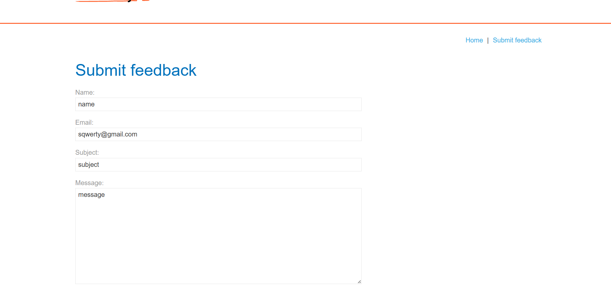
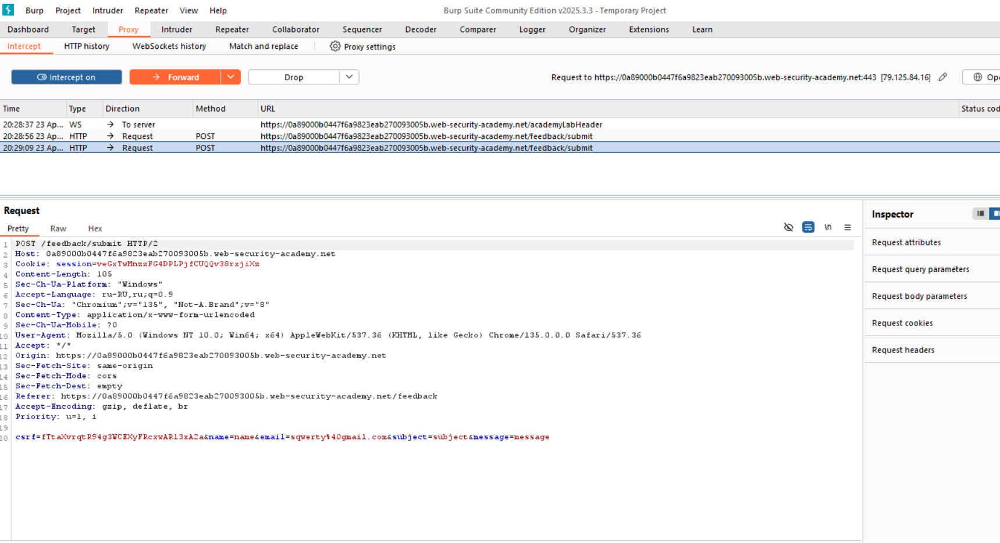
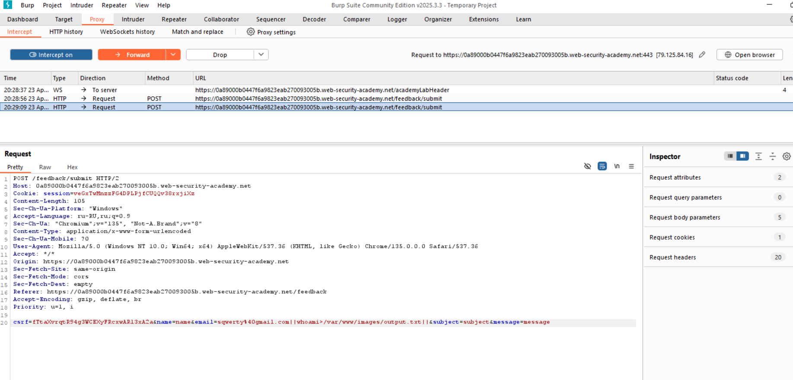
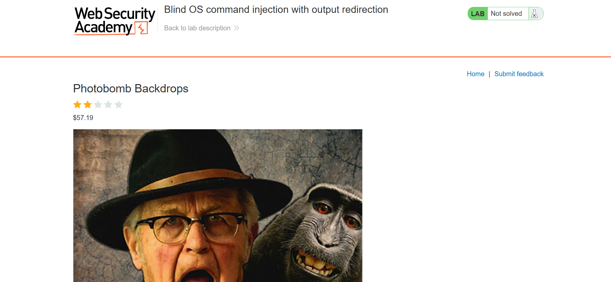
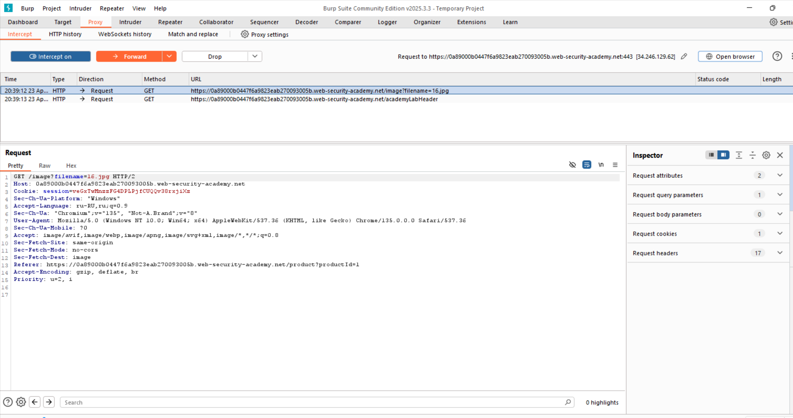
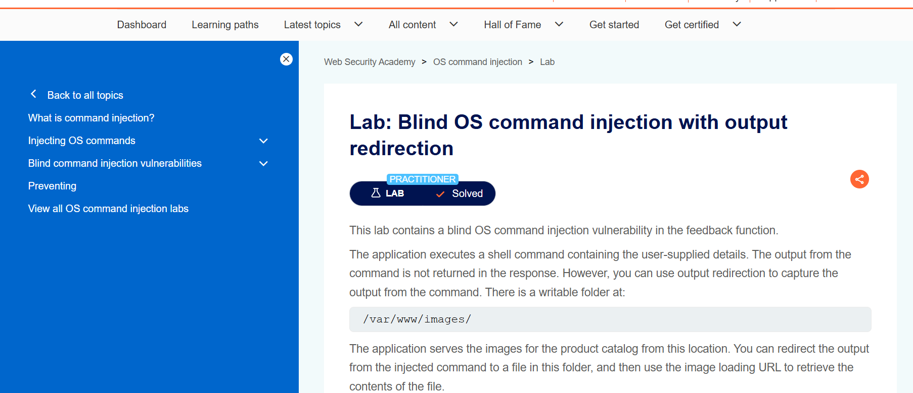

# План атаки

1. Заходим на страницу
2. На странице submit заполняем и отправляем форму
3. В burp suite в email добавляем `||whoami>/var/www/images/output.txt||` и отправляем с помощью Forward
4. Выключаем interception, переходим на страницу с картинкой
5. Включаем interception и перезагружаем.
6. Последний GET запрос отправляем через Forward в burp suite.
7. Видим название файла. Можем изменить его и отправить output.txt

# Скрины

